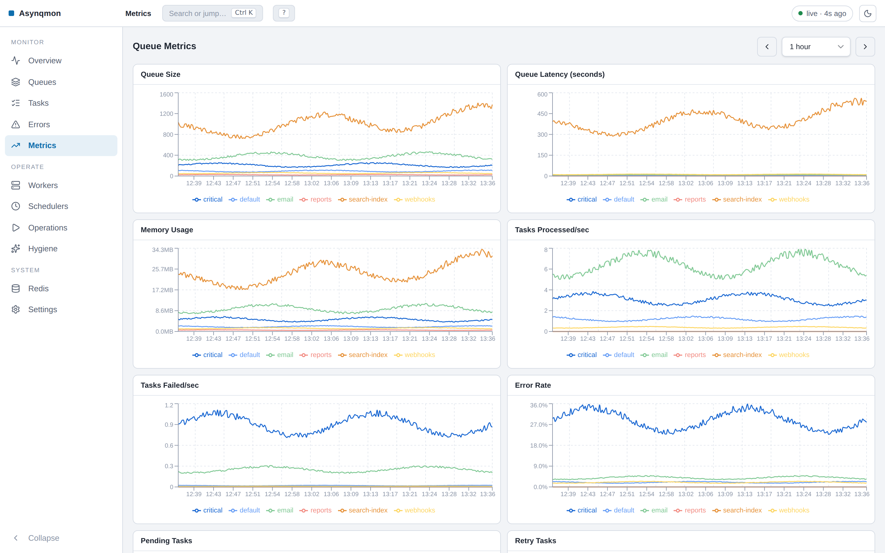
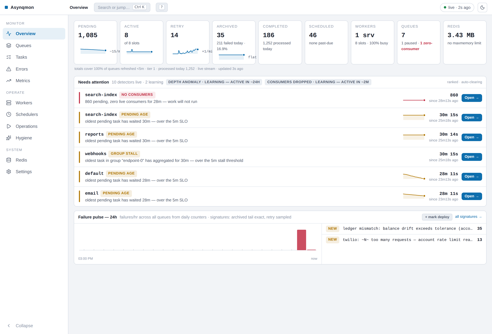
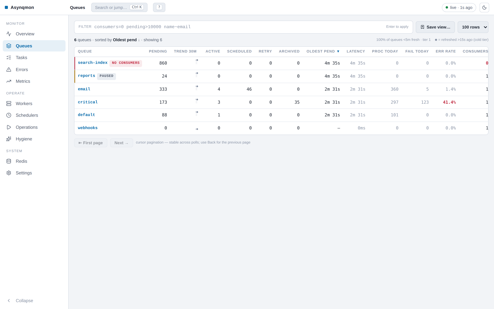
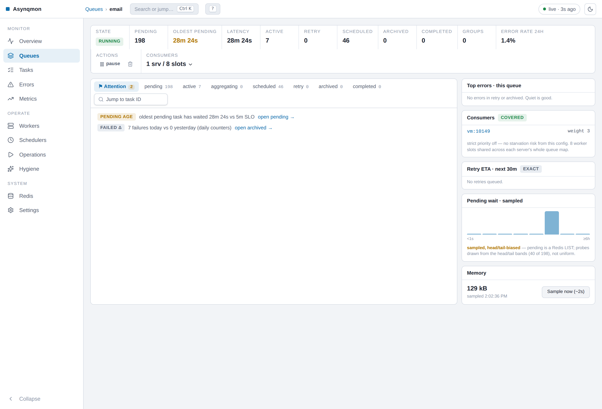
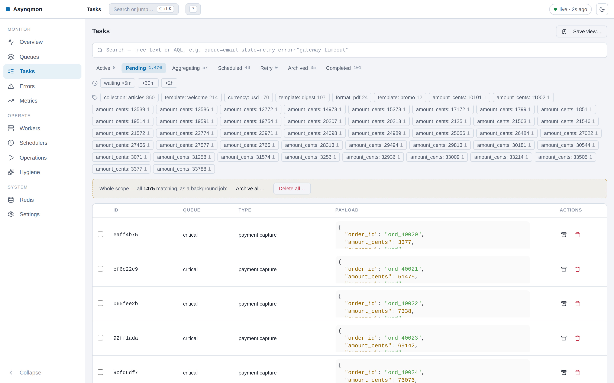
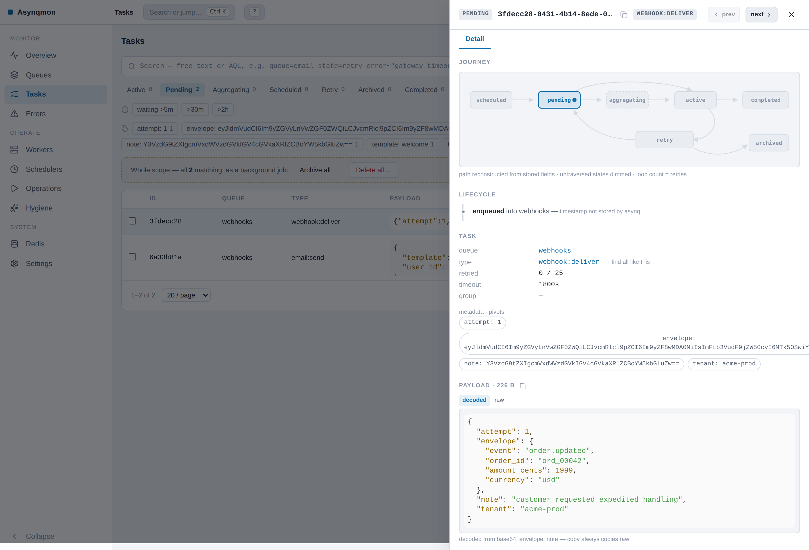
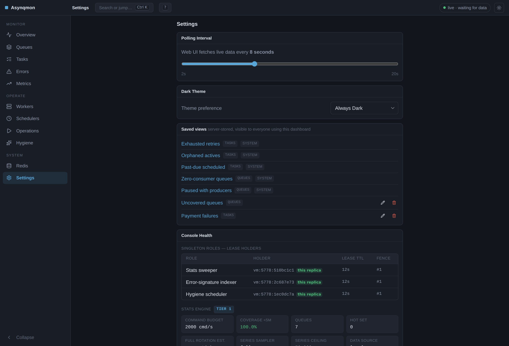

# Web UI for monitoring & administering [Asynq](https://github.com/hibiken/asynq) task queue

## Overview

Asynqmon is a web UI tool for monitoring and administering [Asynq](https://github.com/hibiken/asynq) queues and tasks.
It supports integration with [Prometheus](https://prometheus.io) to display time-series data.

Asynqmon is both a library that you can include in your web application, as well as a binary that you can simply install and run.

## Version Compatibility

Please make sure the version compatibility with the Asynq package you are using.

| Asynq version  | WebUI (asynqmon) version |
| -------------- | ------------------------ |
| 0.24.x - 0.26.x | 0.8.x (this fork)       |
| 0.23.x         | 0.7.x                    |
| 0.22.x         | 0.6.x                    |
| 0.20.x, 0.21.x | 0.5.x                    |
| 0.19.x         | 0.4.x                    |
| 0.18.x         | 0.2.x, 0.3.x             |
| 0.16.x, 0.17.x | 0.1.x                    |

## Requirements

| Component | Requirement |
| --- | --- |
| Redis | 6.2 or later, single instance or Sentinel. Redis Cluster runs the read-only console only (see below). |
| asynq | 0.24.x - 0.26.x |
| Go (build from source) | the version in `go.mod` (1.26) |
| Node (build from source) | 22 or later |

**Why Redis 6.2.** The console needs four commands: `ZMSCORE` (task search
and AQL), `XADD` (the audit log), `MEMORY USAGE` and `HSTRLEN` (the Hygiene
storage report). `ZMSCORE` arrived in Redis 6.2 and sets the floor; the other
three are older. The binary runs `INFO server` once at startup, logs
`redis: server version X`, and prints a `WARNING` when the server is below
6.2.

**Redis ACL.** This fork writes its own keys under the `asynqmon:` prefix,
even in `--read-only` mode, and it publishes on one pub/sub channel. A Redis
user that only reads cannot run it: the background roles take a `SET NX PX`
lease, so a read-only user never acquires one and `/api/fleet/*` answers 503
forever with `acquiring sweeper lease: NOPERM` in the log.

The minimum user for a full console:

```
ACL SETUSER asynqmon on >CHANGEME \
  ~asynq:* ~asynqmon:* \
  &asynqmon:events:jobs &asynq:cancel \
  +@read +@write +@keyspace +@scripting +@transaction +@connection \
  +@pubsub +info +memory|usage
```

On Redis 7.0 or later a read-only deployment can keep the queue data
read-only and still let the console own its own keys:

```
ACL SETUSER asynqmon on >CHANGEME \
  %R~asynq:* %RW~asynqmon:* \
  &asynqmon:events:jobs &asynq:cancel \
  +@read +@write +@keyspace +@scripting +@transaction +@connection \
  +@pubsub +info +memory|usage
```

Pass the user with `--redis-username` / `REDIS_USERNAME` and the password
with `--redis-password` / `REDIS_PASSWORD`.

**Redis Cluster.** `--redis-cluster-nodes` connects, and the read-only
console works, but the write features do not: the fenced Lua batches call
`redis.call` on keys that the script never declares in `KEYS`, which Redis
Cluster rejects with `CROSSSLOT` or "Script attempted to access a non local
key in a cluster node". The binary therefore forces `--disable-stats`,
`--disable-error-index`, `--disable-hygiene` and `--disable-jobs` on when
`--redis-cluster-nodes` is set, and logs that once at startup. The Overview,
Errors, Hygiene and Operations screens are unavailable in that mode.

**Upgrading.** Read [docs/UPGRADING.md](docs/UPGRADING.md) before you move a
deployment from upstream `hibiken/asynqmon` 0.7.2 to this fork. It lists the
keys the fork adds to your Redis, their TTLs, the replica semantics, and the
rollback recipe.

## Install the binary

There're a few options to install the binary:

- [Download a release binary](#release-binaries)
- [Download a docker image](#docker-image)
- [Build a binary from source](#building-from-source)
- [Build a docker image from source](#building-docker-image-locally)

### Release binaries

You can download the release binary for your system from this fork's
[releases page](https://github.com/zkrebbekx/asynqmon/releases) — five
platforms (linux/darwin × amd64/arm64, windows) with SHA256 checksums.

### Docker image

To pull the Docker image:

```bash
# Pull the latest image of this fork
docker pull ghcr.io/zkrebbekx/asynqmon

# Or pin a released version (recommended)
docker pull ghcr.io/zkrebbekx/asynqmon:0.8.0
```

(The upstream `hibiken/asynqmon` image does not include this fork's console.)

### Building from source

To build Asynqmon from source code, make sure you have Go installed ([download](https://golang.org/dl/)). The version in `go.mod` (`1.26`) or higher is required. You also need [Node.js](https://nodejs.org/) version `22` or higher (with `npm`) installed in order to build the frontend assets.

Download the source code of this repository and then run:

```bash
make build
```

The `asynqmon` binary should be created in the current directory.

### Building Docker image locally

To build Docker image locally, run:

```bash
make docker
```

### Deploy on Kubernetes with Helm

A Helm chart is provided in [`charts/asynqmon`](charts/asynqmon). The container
image is published to `ghcr.io/zkrebbekx/asynqmon` by CI on each push to
`master` and on tags.

```bash
helm install asynqmon ./charts/asynqmon \
  --set image.repository=ghcr.io/zkrebbekx/asynqmon \
  --set redis.url=redis://my-redis:6379
```

See the [chart README](charts/asynqmon/README.md) for Redis Cluster, Ingress,
Prometheus `ServiceMonitor`, and cloud IAM (IRSA / Workload Identity) examples.

## Run the binary

To use the defaults, simply run and open http://localhost:8080.

```bash
# with a binary
./asynqmon

# with a docker image
docker run --rm \
    --name asynqmon \
    -p 8080:8080 \
    ghcr.io/zkrebbekx/asynqmon:0.8.0
```

By default, Asynqmon web server listens on port `8080` and connects to a Redis server running on `127.0.0.1:6379`.

To see all available flags, run:

```bash
# with a binary
./asynqmon --help

# with a docker image
docker run ghcr.io/zkrebbekx/asynqmon:0.8.0 --help
```

Here's the available flags:

_Note_: Use `--redis-url` to specify address, db-number, and password with one flag value; Alternatively, use `--redis-addr`, `--redis-db`, and `--redis-password` to specify each value.

| Flag                              | Env                       | Description                                                                                                                  | Default          |
| --------------------------------- | ------------------------- | ---------------------------------------------------------------------------------------------------------------------------- | ---------------- |
| `--port`(int)                     | `PORT`                    | port number to use for web ui server                                                                                         | 8080             |
| `--redis-url`(string)            | `REDIS_URL`               | URL to redis or sentinel server. See [godoc](https://pkg.go.dev/github.com/hibiken/asynq#ParseRedisURI) for supported format | ""               || `--redis-addr`(string)            | `REDIS_ADDR`              | address of redis server to connect to                                                                                        | "127.0.0.1:6379" |
| `--redis-db`(int)                 | `REDIS_DB`                | redis database number                                                                                                        | 0                |
| `--redis-password`(string)        | `REDIS_PASSWORD`          | password to use when connecting to redis server                                                                              | ""               |
| `--redis-username`(string)        | `REDIS_USERNAME`          | redis ACL username sent alongside `--redis-password` in single, cluster, and sentinel modes (plain redis AUTH username, distinct from any cloud-IAM `--redis-user` identity) | ""               |
| `--redis-sentinel-password`(string) | `REDIS_SENTINEL_PASSWORD` | password to authenticate to the sentinel nodes themselves; the redis servers behind them use `--redis-password`            | ""               |
| `--redis-cluster-nodes`(string)   | `REDIS_CLUSTER_NODES`     | comma separated list of host:port addresses of cluster nodes. Setting it forces `--disable-stats`, `--disable-error-index`, `--disable-hygiene` and `--disable-jobs` on — see [Requirements](#requirements) | ""               |
| `--redis-tls`(string)             | `REDIS_TLS`               | server name for TLS validation used when connecting to redis server                                                          | ""               |
| `--redis-insecure-tls`(bool)      | `REDIS_INSECURE_TLS`      | disable TLS certificate host checks                                                                                          | false            |
| `--redis-timeout`(duration)       | `REDIS_TIMEOUT`           | dial, read, and write timeout of every redis connection. Keep it at or below the 2s `/healthz` budget so a hung Redis answers 503 instead of hanging the probe | 2s               |
| `--max-payload-length`(int)       | `MAX_PAYLOAD_LENGTH`      | maximum number of utf8 characters printed in the payload cell in the Web UI (list rows)                                      | 200              |
| `--max-result-length`(int)        | `MAX_RESULT_LENGTH`       | maximum number of utf8 characters printed in the result cell in the Web UI (list rows)                                       | 200              |
| `--max-detail-payload-length`(int) | `MAX_DETAIL_PAYLOAD_LENGTH` | safety cap (utf8 chars) on the formatted payload/result served by the task DETAIL endpoint — the task drawer shows the full payload up to this cap while list cells stay capped by `--max-payload-length` (upstream [#301](https://github.com/hibiken/asynqmon/issues/301)); 0 = unlimited | 262144           |
| `--max-concurrent-scans`(int)     | `MAX_CONCURRENT_SCANS`    | maximum number of task scans (`GET /api/tasks`, `/api/task_metadata`, `/api/task_aggregate`, `POST /api/tasks:batch_filtered`) this process runs at once; further scans get 429 | 4                |
| `--max-scan-ceiling`(int)         | `MAX_SCAN_CEILING`        | largest `max_scan` a task-scan request can ask for; larger values clamp to it                                                | 20000            |
| `--max-sse-connections`(int)      | `MAX_SSE_CONNECTIONS`     | maximum concurrent `/api/fleet/events` streams per replica; extra subscribers get 503 with `Retry-After` (negative = unlimited) | 256              |
| `--enable-metrics-exporter`(bool) | `ENABLE_METRICS_EXPORTER` | enable prometheus metrics exporter to expose queue metrics                                                                   | false            |
| `--prometheus-addr`(string)       | `PROMETHEUS_ADDR`         | address of prometheus server to query time series                                                                            | ""               |
| `--prometheus-basic-auth`(string) | `PROMETHEUS_BASIC_AUTH`   | `user:password` basic-auth credentials sent with every query to `--prometheus-addr` (prefer the env var to keep the secret out of argv) | ""               |
| `--read-only`(bool)               | `READ_ONLY`               | use web UI in read-only mode. The background writers (stats sweeper, error index, hygiene generator) keep running and keep writing `asynqmon:*` keys; only the bulk-job runner is off | false            |
| `--enable-enqueue`(bool)          | `ENABLE_ENQUEUE`          | enable creating tasks from the web UI (`POST /api/queues/{qname}/tasks`, powers clone-and-edit and the Schedulers screen's Run-now, upstream [#337](https://github.com/hibiken/asynqmon/issues/337)); always excluded in read-only mode | false            |
| `--correlation-keys`(string)      | `CORRELATION_KEYS`        | comma separated list of payload keys the task drawer's Flow view recognizes as correlation ids, in priority order ([details](#flow-view--correlation-keys)) | "trace_id,correlation_id,request_id" |
| `--cors-allowed-origins`(string)  | `CORS_ALLOWED_ORIGINS`    | comma separated list of origins allowed to make cross-origin requests (empty = same-origin only; cross-origin mutations are rejected) | ""               |
| `--stats-interval`(duration)      | `STATS_INTERVAL`          | interval between background fleet stats sweeps (powers the Overview, Queues directory, sparklines and attention findings)     | 5s               |
| `--disable-stats`(bool)           | `DISABLE_STATS`           | disable the background stats sweeper and the `/api/fleet` endpoints; the console degrades to the classic per-queue views      | false            |
| `--disable-error-index`(bool)     | `DISABLE_ERROR_INDEX`     | disable this replica's error-signature indexer; `/api/errors` still serves the shared index another replica writes            | false            |
| `--disable-hygiene`(bool)         | `DISABLE_HYGIENE`         | disable this replica's scheduled hygiene reports; `/api/hygiene` still serves the persisted reports                           | false            |
| `--disable-jobs`(bool)            | `DISABLE_JOBS`            | disable this replica's bulk-job runner; `/api/jobs` still works and another replica runs the jobs                             | false            |
| `--job-concurrency`(int)          | `JOB_CONCURRENCY`         | maximum number of bulk jobs this replica works at once                                                                       | 2                |
| `--hygiene-webhook-url`(string)   | `HYGIENE_WEBHOOK_URL`     | URL that receives a POST of every generated hygiene report (best effort, one attempt)                                        | ""               |
| `--hygiene-run-in-read-only`(bool) | `HYGIENE_RUN_IN_READ_ONLY` | keep `POST /api/hygiene/{kind}/run` available in `--read-only` mode; by default the route is blocked like every other mutation | false            |
| `--attention-pending-age-slo`(duration) | `ATTENTION_PENDING_AGE_SLO` | raise a `PENDING_AGE` finding when a queue's oldest pending task has waited longer than this                             | 5m               |
| `--attention-retry-storm-threshold`(int) | `ATTENTION_RETRY_STORM_THRESHOLD` | raise a `RETRY_STORM` finding when at least this many retries fire within the next 5 minutes                    | 1000             |
| `--attention-paused-long-after`(duration) | `ATTENTION_PAUSED_LONG_AFTER` | raise a `PAUSED_LONG` finding when a queue has been paused longer than this                                       | 168h (7d)        |
| `--attention-group-stall-after`(duration) | `ATTENTION_GROUP_STALL_AFTER` | raise a `GROUP_STALL` finding when the oldest member of a group has aggregated longer than this                   | 5m               |
| `--auth-header`(string)           | `AUTH_HEADER`             | reverse-proxy header resolved as the acting user for the audit log (e.g. `X-Auth-Request-User`) — see [Identity & the audit log](#identity--the-audit-log) | "" |
| `--trusted-proxies`(string)       | `TRUSTED_PROXIES`         | comma separated CIDRs the auth header is trusted from. **Empty means trusted from any peer**, so the binary refuses to start with `--auth-header` and no `--trusted-proxies` unless `--allow-untrusted-auth-header` is set | "" |
| `--require-identity`(bool)        | `REQUIRE_IDENTITY`        | refuse mutating requests (403 JSON) that carry no resolvable identity (auth header or trusted basic-auth user)                | false            |
| `--trust-basic-auth-user`(bool)   | `TRUST_BASIC_AUTH_USER`   | accept the HTTP Basic-Auth username as the acting user for the audit log. asynqmon never verifies the password, so set this only behind a proxy that does | false            |
| `--allow-untrusted-auth-header`(bool) | `ALLOW_UNTRUSTED_AUTH_HEADER` | start with `--auth-header` set and `--trusted-proxies` empty. The header is then trusted from every peer, which lets any direct client forge the audit actor (insecure) | false            |
| `--purge-owned-keys`(bool)        | `PURGE_OWNED_KEYS`        | delete every `asynqmon:*` key in the configured redis database, print the counts, and exit. The rollback helper; it never touches `asynq:*` keys — see [docs/UPGRADING.md](docs/UPGRADING.md) | false            |
| `--version`(bool)                 | —                         | print the asynqmon version and exit                                                                                          | false            |

### Connecting to Redis

To connect to a **single redis server**, use either `--redis-url` or (`--redis-addr`, `--redis-db`, and `--redis-password`).

Example:

```sh
$ ./asynqmon --redis-url=redis://:mypassword@localhost:6380/2

$ ./asynqmon --redis-addr=localhost:6380 --redis-db=2 --redis-password=mypassword
```

To connect to **redis-sentinels**, use `--redis-url`.

Example:

```sh
$ ./asynqmon --redis-url=redis-sentinel://:mypassword@localhost:5000,localhost:5001,localhost:5002?master=mymaster
```

The password in the `redis-sentinel://` URL authenticates to the **sentinel
nodes**. To keep that secret out of the URL, provide it via
`--redis-sentinel-password` or the `REDIS_SENTINEL_PASSWORD` env var instead
(it takes precedence over the URL). The redis servers *behind* the sentinels
authenticate separately with `--redis-username`/`--redis-password`
(`REDIS_USERNAME`/`REDIS_PASSWORD`):

```sh
$ REDIS_SENTINEL_PASSWORD=sentinelpass REDIS_PASSWORD=redispass \
    ./asynqmon --redis-url=redis-sentinel://localhost:5000,localhost:5001,localhost:5002?master=mymaster
```

To connect to a **redis-cluster**, use `--redis-cluster-nodes`.

Example:

```sh
$ ./asynqmon --redis-cluster-nodes=localhost:7000,localhost:7001,localhost:7002,localhost:7003,localhost:7004,localhost:7006
```

On Redis Cluster the binary forces the background write features off and
serves the read-only console only. See
[Requirements](#requirements) for the reason.

### Health check endpoint

The server exposes `GET /healthz` (outside `/api`, no auth, no side effects)
for orchestrator liveness/readiness probes. It PINGs Redis with a 2-second
budget and answers:

- `200 {"status":"ok"}` — Redis reachable
- `503 {"status":"unavailable","error":"..."}` — Redis unreachable

The bundled Helm chart points its readiness probe at `/healthz`; its liveness
probe is a TCP check on the HTTP port. An HTTP liveness probe on `/healthz`
restart-loops the pods during a Redis outage, and a restart cannot fix Redis.

### Limits and error responses

The API bounds every unbounded operation upstream left open. The limits are
flags (see the table above); these are the defaults and the status codes they
produce.

| Limit | Default | What happens at the limit |
| --- | --- | --- |
| Page size on `/api/queues/{q}/{state}_tasks` | 20, max 1000 | The size clamps. The payload then carries `page_size_applied` with the size actually used. |
| `max_scan` on a task scan | ceiling 20000 (`--max-scan-ceiling`) | The value clamps to the ceiling. |
| Concurrent task scans per replica | 4 (`--max-concurrent-scans`) | `429 {"error":"too many concurrent scans"}` |
| Matches on `POST /api/tasks:batch_filtered` | 2000 | `400` naming `POST /api/jobs`, which previews, audits and throttles a large set as a background job. |
| Concurrent `/api/fleet/events` streams | 256 (`--max-sse-connections`) | `503` with `Retry-After`. |
| `POST /api/hygiene/{kind}/run` | one run per kind per 30s | `429`. The route also obeys `--read-only` unless `--hygiene-run-in-read-only` is set. |
| Enqueue body | 1 MB payload, 64 headers | `400` with a field-specific message. |

Error bodies are JSON (`{"error":"..."}`), never `text/plain`:

- `404` — the queue or the task does not exist.
- `400` — the request is wrong (an unknown queue name on enqueue, a deadline
  in the past, a queue that is not empty).
- `429` — a limit in the table above.
- `503 {"error":"redis unavailable"}` — Redis did not answer.
- `500 {"error":"internal error"}` — anything else.

A `5xx` body is deliberately generic. The full error, with the Redis or
Prometheus address it names, goes to the process log instead of to the
browser.

**Queue names containing `/`.** asynq allows a `/` in a queue name; the API
matches a queue name against a single URL path segment, so such a name
reaches no route, not even percent-encoded. Reads through the fleet endpoints
still work. The console shows a notice on those queues and disables their
mutating controls (pause, resume, delete, bulk verbs, per-row actions).

### Integration with Prometheus

The binary supports two flags to enable integration with [Prometheus](https://prometheus.io/).

First, enable metrics exporter to expose queue metrics to Prometheus server by passing `--enable-metrics-exporter` flag.
The metrics data is now available under `/metrics` for Prometheus server to scrape.

Once the metrics data is collected by a Prometheus server, you can pass the address of the Prometheus server to asynqmon to query the time-series data.
The address can be specified via `--prometheus-addr`. This enables the metrics view on the Web UI.

If your Prometheus sits behind HTTP basic auth, provide the credentials as
`user:password` via `--prometheus-basic-auth` or (preferably) the
`PROMETHEUS_BASIC_AUTH` env var; asynqmon attaches them to every proxied
query. The credentials are never logged.



### Examples

```bash
# with a local binary; custom port and connect to redis server at localhost:6380
./asynqmon --port=3000 --redis-addr=localhost:6380

# with prometheus integration enabled
./asynqmon --enable-metrics-exporter --prometheus-addr=http://localhost:9090

# with Docker (connect to a Redis server running on the host machine)
docker run --rm \
    --name asynqmon \
    -p 3000:3000 \
    ghcr.io/zkrebbekx/asynqmon:0.8.0 --port=3000 --redis-addr=host.docker.internal:6380

# with Docker (connect to a Redis server running in the Docker container)
docker run --rm \
    --name asynqmon \
    --network dev-network \
    -p 8080:8080 \
    ghcr.io/zkrebbekx/asynqmon:0.8.0 --redis-addr=dev-redis:6379
```

Next, go to [localhost:8080](http://localhost:8080). The **Overview** landing
screen shows fleet-wide KPIs, the failure pulse, and the attention list of
queues that need a human:



**Queues directory** — every queue, sortable by any column, with 30-minute
pending sparklines, per-row pause/resume, and the filter grammar in the
search box:



**Queue workspace** — drill into one queue: the health strip (with
pause/resume/delete controls), an Attention tab, all seven state tabs, and
the top-errors rail:



**Tasks console** — browse tasks across all queues; the queue is just a
filter. Plain words search id/type/queue/payload; clause-shaped queries are
[AQL](#task-search-aql). Metadata chips (parsed from each task's JSON
payload) drill down with `key=value` filters:



## The console

This fork ships a substantially extended dashboard beyond upstream asynqmon.
A quick map of what's there and how to find it:

### Overview & Queues directory

The **Overview** page is the landing screen: fleet-wide KPI tiles, a failure
pulse, and an *attention* list of queues that need a human (no consumers with
pending work, paused with backlog, past-due scheduled tasks, orphaned active
tasks, error-rate spikes). It is powered by a background stats sweeper
(`--stats-interval`, disable with `--disable-stats`) that budgets its own
Redis traffic so the dashboard never hammers the queues it watches (see
[docs/SCALE.md](docs/SCALE.md)).

The **Queues** directory lists every queue with live sparklines and accepts a
filter grammar in its search box — space-separated `field OP value` clauses
that AND together:

```
consumers=0 pending>10000 name~email paused=true error_rate>0.05 latency>5m
```

Numeric fields (`pending`, `active`, `retry`, `archived`, `completed`,
`groups`, `consumers`, `processed_today`, `failed_today`, `orphans`,
`past_due`) take `= != > >= < <=`; `name~sub` is a substring match; age
fields (`latency` / `oldest_pending_age`) accept durations. Clicking a queue
opens its **workspace**: a health strip (with pause/resume/delete controls),
an Attention tab, all seven state tabs, and an error-clusters rail.

### Task search (AQL)

The **Tasks** console searches across all queues without picking one first.
Plain words are a case-insensitive substring search over id/type/queue/
payload (same as upstream). Clause-shaped queries are parsed as **AQL** —
`field OP value` clauses, space = AND:

```
queue=email state=retry retries>3 error~"connection refused"
meta.user_id=1002 payload~timeout
state=scheduled next_run<30m
state=pending pending_age>1h
state=active running>5m orphaned
```

Fields: `queue`, `type`, `id`, `payload`, `error`, `retries`, `meta.KEY`
(top-level JSON payload keys), `state`, `group`, plus state-specific
predicates — `pending_age`, `running`, `deadline_pct`, `orphaned` (active),
`next_run`, `past_due` (scheduled), `failed_after`/`failed_before`, `died`
(archived), `expires` (completed), `group_age` (aggregating). Operators are
`=`, `~` (substring), and `> >= < <=` for numeric/time fields; durations use
Go syntax plus a `d` day suffix (`90s`, `5m`, `1d12h`). A clause a state
cannot answer is rejected with a caret and the nearest supported alternative
— never silently dropped. Results beyond the scan budget continue with a
resumable cursor, or can be handed to a background **count** job that scans
to completion for an exact number.

Four details are worth knowing:

- `pending_age` needs asynq's `pending_since` record. A task that reached
  pending through "Run now", "Run all" or a worker shutdown requeue carries
  no such record, so `pending_age>` skips it. List those tasks with
  `pending_age=unknown`; the response also counts them as
  `pending_since_unknown`.
- Free text that looks like a clause must be quoted. `user=42` is read as a
  clause on an unknown field `user` and is rejected; write `"user=42"` to
  search for the text. The same holds for text containing `<`, `>` or `~`.
- `died>` reads the archived score, so it also matches a task that an
  operator archived by hand, not only one that exhausted its retries.
- `meta.KEY=` compares a numeric payload value numerically, so `meta.n=10`
  matches `10`, `10.0` and `1e1`. The comparison runs in float64, so an
  integer larger than 2^53 (9007199254740992) cannot be matched exactly.

### Task drawer: base64 payload decoding

When a task's payload or result carries base64-encoded values — a common
pattern for envelope fields and nested JSON — the task drawer shows the
**decoded** rendering by default, with the raw view one click away:



Base64-of-JSON embeds as structure (the `envelope` above renders as its
inner object), plain-text values decode in place, and a payload that is one
bare base64 string is handled too. A note under the block names exactly
which fields were transformed ("decoded from base64: envelope, note"), and
the copy button always copies the **raw** payload, so what you paste
elsewhere is what's stored.

Detection is deliberately conservative — a wrongly-"decoded" field is worse
than a raw one. A value must have strict base64 shape (≥16 chars, standard
or URL-safe alphabet, a length base64 can produce, ≥12 decoded bytes), mix
character classes (single-class strings like slugs and long words are the
main false-positive source), and decode to fully printable UTF-8 — which is
what makes hex strings, dashless UUIDs, and prefixed ids that merely look
base64-ish reliably stay raw. Anything failing any layer renders raw with
no toggle at all.

### Operations, bulk jobs & the audit log

Every whole-scope verb (run/archive/delete/cancel "all matching") is a
**bulk job**: streaming preview with exact counts, Redis cost disclosure,
throttle selection, a mandatory audited reason, typed confirmation for large
deletes, and a post-run verify panel. The **Operations** page lists jobs
(pause/resume/cancel), their failure reports, and the audit log. Single-task
enqueueing (clone & edit, Schedulers "Run now") is behind `--enable-enqueue`.

### Errors, Hygiene, Workers, Schedulers

- **Errors** groups failures into signatures (indexed, trend-annotated) and
  pivots into the matching retry/archived tasks or a pre-scoped bulk job.
- **Hygiene** runs scheduled inventory / dead-letter / scheduler-health
  reports with configurable cadence and webhook notifications.
- **Workers** shows servers and per-queue consumer coverage; **Schedulers**
  adds run-outcome traces to the entry list.

### Saved views, palette & keyboard

`⌘K` opens the command palette (queues, views, verbs, navigation). Saved
views capture a Tasks-console query as a shareable, server-stored view.
Press `?` anywhere for the keyboard cheatsheet — the Tasks console supports
`j/k` row navigation, `x`/`⇧x` selection, `r`un/`e`(archive)/`#`(delete),
`p`eek drawer, `[`/`]` prev/next in the drawer, and `/` to focus the query
bar.

### Identity & the audit log

Mutations are attributed in the audit log. Behind a reverse proxy that
authenticates users, pass the identity header with `--auth-header` (e.g.
`X-Auth-Request-User`) **and** restrict who may assert it with
`--trusted-proxies=10.0.0.0/8`. With no CIDRs configured the header is
trusted from every peer, so any client that can reach the listener directly
could forge the audit actor. The binary therefore **refuses to start** with
`--auth-header` set and `--trusted-proxies` empty; pass
`--allow-untrusted-auth-header` to accept that risk deliberately.

asynqmon never verifies an HTTP Basic-Auth password, so a Basic-Auth username
is not an identity by itself. It becomes the audit actor only when
`--trust-basic-auth-user` is set, or when the request arrives from a CIDR in
`--trusted-proxies`. Set `--trust-basic-auth-user` only behind a proxy that
checks the password.

`--require-identity` refuses mutations with no resolvable identity; without
any of this, actions are logged as `anonymous@<ip>`.

### Flow view & correlation keys

When a task's JSON payload carries a recognized correlation id, the task
drawer grows a **Flow** tab showing every task that shares the same id across
all queues and states, time-ordered into a de-facto chain. Each entry pivots
to its own drawer, and a count line summarizes the chain ("N tasks share
`trace_id=...` across M queues").

**How producers opt in.** This is purely a payload convention — no asynq
changes and no extra infrastructure. Put one of the recognized keys in your
task payloads at enqueue time:

```json
{"user_id": 42, "trace_id": "tr-7f3e9a"}
```

Every task enqueued with the same `trace_id` value then shows up in each
other's Flow tab.

**Configuring the recognized keys.** By default the drawer recognizes
`trace_id`, `correlation_id`, and `request_id` (first present wins). Override
the list with the `--correlation-keys` flag or the `CORRELATION_KEYS` env
var:

```bash
./asynqmon --correlation-keys=order_ref,trace_id
```

The configured list is served to the UI via `GET /api/features`
(`"correlation_keys"`); older UIs ignore it and older backends fall back to
the default list. Keys are matched against **top-level** payload fields; a
key nested exactly one object deep (e.g. `{"meta": {"trace_id": ...}}`) is
also recognized, but is then matched by searching for the value rather than
the `key=value` pair, so keep correlation values reasonably unique
(UUID-like) if you nest them.

**Honesty caveats.** asynq stores no parent/child or causal links between
tasks, so the Flow view is a reconstruction, not a trace: ordering is
inferred from the timestamps asynq happens to store (completion and
last-failure times — tasks without one sort last), the chain is bounded by
the search caps (a "may be incomplete" note appears when they are hit), and
tasks that were deleted or never enqueued simply don't appear. The view
labels this honestly in the UI; treat it as a strong hint about related
work, not a distributed trace.

### Observing run durations (opt-in middleware)

asynq stores no run duration for finished tasks and no per-attempt history —
`LastErr` is overwritten on every retry, `pending_since` is deleted at
dequeue, and completed tasks carry no start/end. The dashboard therefore
cannot honestly show "how long did this run" or "what happened on attempt 2"
— unless your workers opt in.

The `github.com/zkrebbekx/asynqmon/observe` package provides an asynq server
middleware that records exactly that:

```go
import "github.com/zkrebbekx/asynqmon/observe"

rc := redis.NewClient(&redis.Options{Addr: "localhost:6379"}) // same Redis/DB as the asynq server
mux := asynq.NewServeMux()
mux.Use(observe.Middleware(rc))
mux.HandleFunc("email:send", handleEmailSend)
```

**What it records.** One JSON record per attempt: attempt number, start
time, duration, outcome (`ok`, `error` with the message capped at 500 bytes,
or `panic` — recorded, then rethrown so asynq's own recovery is untouched),
worker `host:pid`, and the task's queue/id/type. A small summary hash tracks
`first_seen`, `total_attempts`, `last_duration_ms` and `total_busy_ms`.

**Bounds.** Records live in asynqmon-owned keys
(`asynqmon:obs:att:<queue>:<task_id>` and
`asynqmon:obs:sum:<queue>:<task_id>`), trimmed to the last 30 attempts and
expiring **24 hours** after the last write. By default the middleware records
only the `error` and `panic` outcomes, so a healthy fleet writes almost
nothing. Tune it with `observe.WithOutcomes` (add `observe.OutcomeOK` to
record successful attempts too), `observe.WithSampling(rate)` (record only a
fraction of the tasks), `observe.WithAttemptCap`, `observe.WithTTL` and
`observe.WithKeyPrefix`.

One recorded task costs about 750 bytes in Redis. The footprint is therefore:

```
recorded_tasks_per_day x TTL_in_days x 750 B
```

200,000 recorded tasks per day at the default 24h TTL keep about 150 MB
resident. Recording every outcome of every task of a busy fleet for 7 days,
which was the old default, keeps about 1 GB. The middleware also increments
`asynqmon:obs:count:<YYYY-MM-DD>` (48h TTL) so you can read the daily figure
with one `GET` instead of a `SCAN`.

Writes are best-effort: a recording failure never fails or delays the task
(dropped writes are counted; see `observe.DroppedWrites`).

**What the dashboard shows.** The task drawer grows an **Attempt history**
section (per-attempt rows with duration, outcome and worker), and finished
tasks show "last run 3.4s · observed" in the drawer lifecycle and the
Completed/Archived tables, served by
`GET /api/queues/{qname}/tasks/{task_id}/observed`.

**Honesty statement.** Coverage depends on worker adoption: only attempts
that ran through an adopting worker are recorded, and the dashboard labels
observed data as such ("recorded by observe middleware — attempts before
adoption are not shown"). Tasks without records simply show nothing — the
dashboard never fabricates history.

**Settings and adaptive dark mode** — poll cadence, theme, saved-view
management, and the console-health diagnostics:



## Import as a Library

[](https://pkg.go.dev/github.com/zkrebbekx/asynqmon)

Asynqmon is also a library which can be imported into an existing web application.

Example with [net/http](https://pkg.go.dev/net/http):

```go
package main

import (
	"log"
	"net/http"

	"github.com/hibiken/asynq"
	"github.com/zkrebbekx/asynqmon"
)

func main() {
	h := asynqmon.New(asynqmon.Options{
		RootPath: "/monitoring", // RootPath specifies the root for asynqmon app
		RedisConnOpt: asynq.RedisClientOpt{Addr: ":6379"},
	})

    // Note: We need the tailing slash when using net/http.ServeMux.
	http.Handle(h.RootPath()+"/", h)

	// Go to http://localhost:8080/monitoring to see asynqmon homepage.
	log.Fatal(http.ListenAndServe(":8080", nil))
}
```

Example with [gorilla/mux](https://pkg.go.dev/github.com/gorilla/mux):

```go
package main

import (
	"log"
	"net/http"

	"github.com/gorilla/mux"
	"github.com/hibiken/asynq"
	"github.com/zkrebbekx/asynqmon"
)

func main() {
	h := asynqmon.New(asynqmon.Options{
		RootPath: "/monitoring", // RootPath specifies the root for asynqmon app
		RedisConnOpt: asynq.RedisClientOpt{Addr: ":6379"},
	})

	r := mux.NewRouter()
	r.PathPrefix(h.RootPath()).Handler(h)

	srv := &http.Server{
		Handler: r,
		Addr:    ":8080",
	}

	// Go to http://localhost:8080/monitoring to see asynqmon homepage.
	log.Fatal(srv.ListenAndServe())
}
```

Example with [labstack/echo](https://github.com/labstack/echo)):


```go
package main

import (
	"github.com/labstack/echo/v4"
	"github.com/hibiken/asynq"
	"github.com/zkrebbekx/asynqmon"
)

func main() {
        e := echo.New()

	mon := asynqmon.New(asynqmon.Options{
		RootPath: "/monitoring/tasks",
		RedisConnOpt: asynq.RedisClientOpt{
			Addr: ":6379",
			Password: "",
			DB: 0,
		},
	})
	e.Any("/monitoring/tasks/*", echo.WrapHandler(mon))
	e.Start(":8080")
}
```


## License

Copyright (c) 2019-present [Ken Hibino](https://github.com/hibiken) and [Contributors](https://github.com/hibiken/asynqmon/graphs/contributors). Copyright (c) 2026 [zkrebbekx](https://github.com/zkrebbekx) for the changes in this fork. `Asynqmon` is free and open-source software licensed under the [MIT License](https://github.com/hibiken/asynq/blob/master/LICENSE). Official logo was created by [Vic Shóstak](https://github.com/koddr) and distributed under [Creative Commons](https://creativecommons.org/publicdomain/zero/1.0/) license (CC0 1.0 Universal).
